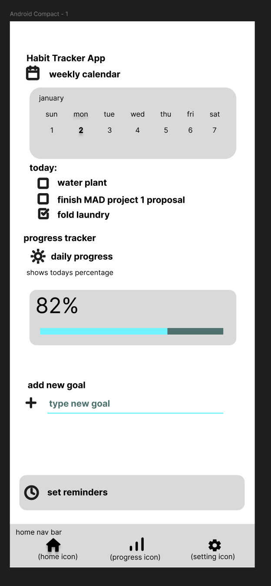
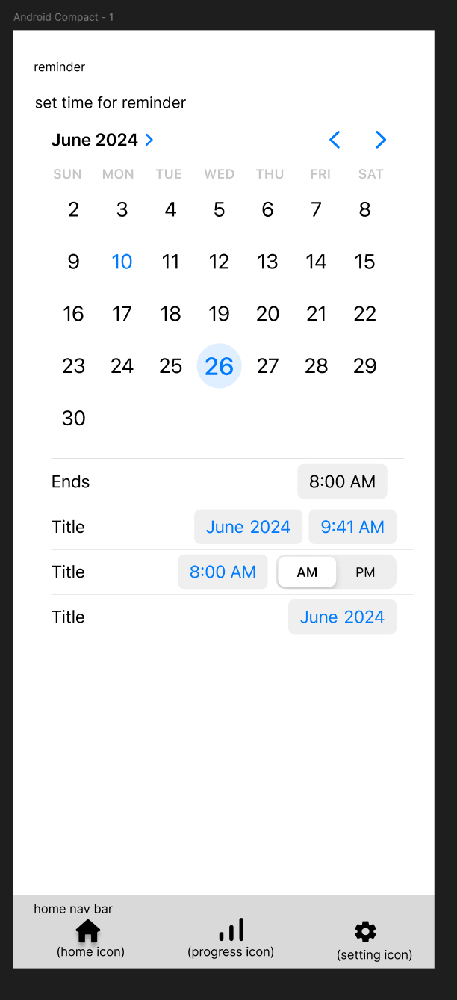
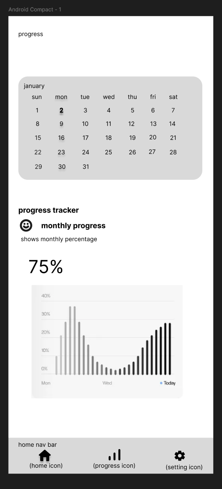
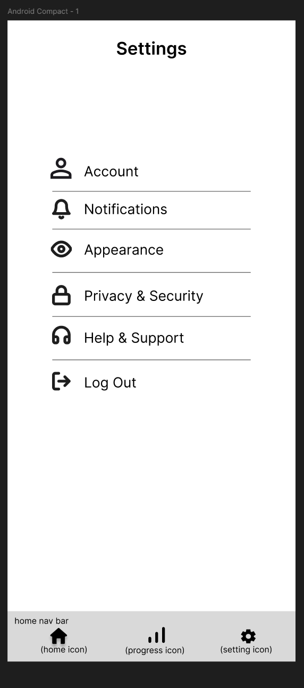

# Project_01
Mobile App Development Project 1 (Ryan B, Tiffani S.)

## Proposed Group Members:
<ins>**Members**</ins>
- [X] Ryan Bouapheng & Tiffani Singleton

## Project summary:
<ins>**Habit Tracker App**</ins>
- [ ] Daily Habit Logging: Users can log habits like exercise, reading, or drinking water.
- [ ] Customizable Habits: Allow users to define their own habits.
- [ ] Progress Overview: Simple charts or stats to track streaks.
- [ ] Reminders & Notifications: Set daily reminders for habits.
- [ ] Local Storage: Save habit data locally for tracking progress offline.

## GitHub Repository link for the project
<ins>**Link**</ins>
- [x] https://github.com/laosrb/Project_01/

## Proposed the wireframe - a visual representation, a detailed outline of the user interface (UI)and layout of an app.
<ins>**Wireframe Requirements**</ins>

- [x] Layouts - Number and name of unique screens in Project
- [x] Functionality - Proposed Use case from transitioning from screen to screen.
- [x] User Experience - Proposed Use cases for each Screen
- [x] Iterative design – Test cases and approach to refine the improvements

## Screen

### Home Page

### Reminder Page

### Progress Page

### Settings Page

